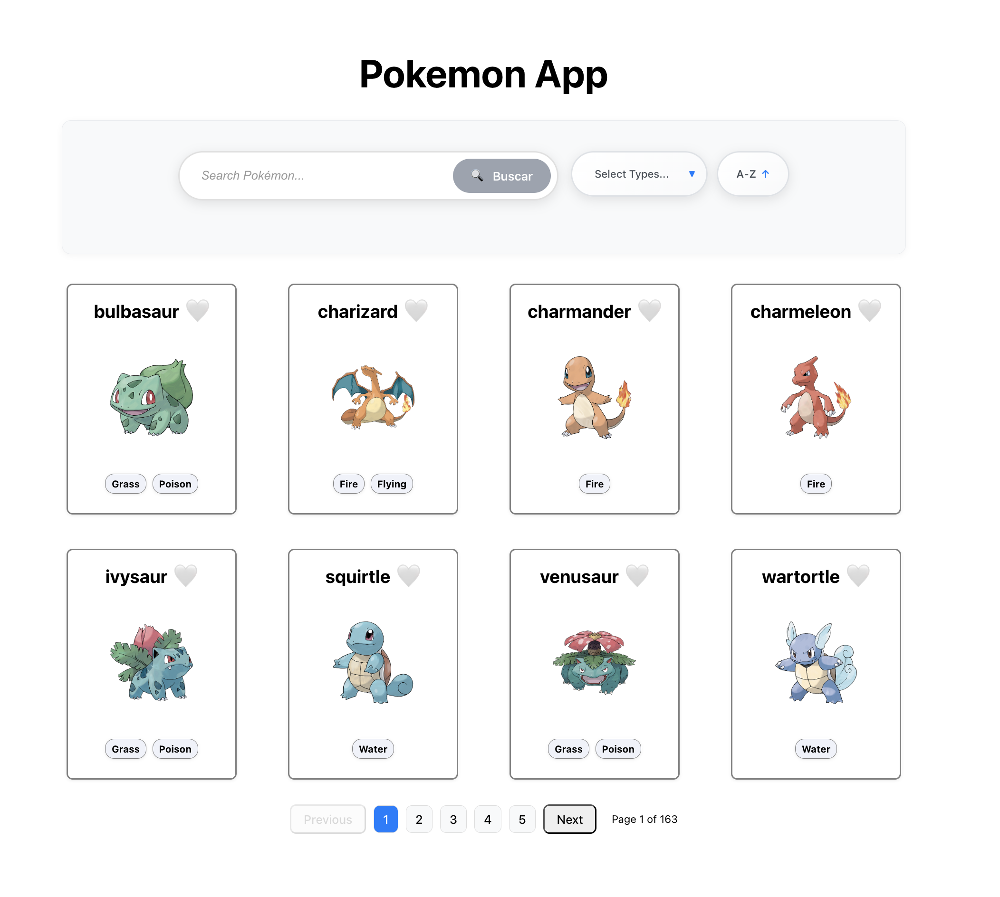

*# 🎯 Pokemon App - Aprende React desde Cero





Una aplicación web interactiva de Pokemon desarrollada con **React** y **Vite**, diseñada especialmente para **aprender React desde cero**. Esta app integra los conceptos más importantes de React de manera práctica y progresiva.

## 🚀 ¿Qué aprenderás?

Esta aplicación cubre los **conceptos fundamentales de React** que todo desarrollador debe dominar:

### 📚 Conceptos de React Implementados

- **🎣 Hooks Modernos**
  - `useState` - Manejo de estado local
  - `useEffect` - Efectos secundarios y ciclo de vida
  - `useSelector` y `useDispatch` - Integración con Redux

- **🔄 Gestión de Estado Global**
  - **Redux Toolkit** - Estado centralizado de la aplicación
  - Manejo de filtros, ordenamiento y paginación
  - Slices y actions para Pokemon

- **🛣️ Navegación y Routing**
  - **React Router v6** - Navegación entre páginas
  - Rutas dinámicas y parámetros
  - Layout compartido con navegación condicional

- **🎨 Componentes y Props**
  - Componentes funcionales reutilizables
  - Props y comunicación entre componentes
  - Composición de componentes

- **📱 UI/UX Avanzada**
  - **SCSS** para estilos modulares
  - Diseño responsive
  - Skeleton loading states
  - Animaciones y transiciones

- **🔍 Funcionalidades Interactivas**
  - Búsqueda en tiempo real
  - Filtros por tipo de Pokemon
  - Ordenamiento alfabético
  - Paginación dinámica

## 🎮 Características de la App

- ✅ **Explorar Pokemon** - Navega por una extensa colección de Pokemon
- ✅ **Búsqueda Inteligente** - Busca Pokemon por nombre
- ✅ **Filtros Avanzados** - Filtra por tipos (Fuego, Agua, Planta, etc.)
- ✅ **Ordenamiento** - Organiza alfabéticamente
- ✅ **Paginación** - Navega eficientemente por grandes listas
- ✅ **Vista Detallada** - Información completa de cada Pokemon
- ✅ **Diseño Responsive** - Funciona perfectamente en móviles y desktop
- ✅ **Loading States** - Experiencia de usuario fluida con skeletons

## 🛠️ Tecnologías Utilizadas

| Tecnología | Propósito |
|------------|-----------|
| **React 18** | Biblioteca principal para la UI |
| **Redux Toolkit** | Gestión de estado global |
| **React Router v6** | Navegación y routing |
| **Vite** | Herramienta de desarrollo rápida |
| **SCSS** | Estilos avanzados y modulares |
| **Pokemon API** | Datos reales de Pokemon |
| **ESLint** | Calidad y consistencia del código |

## 🚦 Instalación y Uso

```bash
# Clona el repositorio
git clone [tu-repositorio]
cd pokemon-app

# Instala las dependencias
npm install

# Inicia el servidor de desarrollo
npm run dev
```

## 🎯 Perfecto para Principiantes

Esta aplicación está **diseñada específicamente para aprender React desde cero**:

- 🧩 **Progresión lógica** de conceptos simples a avanzados
- 🎨 **UI atractiva** que mantiene la motivación
- 🔧 **Casos de uso reales** que encontrarás en proyectos profesionales


## 📂 Estructura del Proyecto

```
src/
├── components/          # Componentes reutilizables
│   ├── controlsBar/    # Barra de controles (búsqueda, filtros)
│   ├── pokemonCard/    # Tarjeta individual de Pokemon
│   ├── searchBar/      # Componente de búsqueda
│   └── ...
├── pages/              # Páginas de la aplicación
│   ├── home/           # Página principal
│   └── PokemonDetail/  # Detalle de Pokemon
├── store/              # Configuración de Redux
│   └── pokemon/        # Slice de Pokemon
├── services/           # APIs y servicios
└── routes/             # Configuración de rutas
```

---

**With love by Gonza** 🚀✨
